# SignalForge

**Cloud-native security detection & response platform.** SignalForge ingests security
telemetry from Linux hosts, cloud audit trails, an identity provider and an
application audit log; normalizes all of it into a single [OCSF]-shaped schema;
evaluates [Sigma] detection rules over the stream; correlates the resulting alerts
into incidents with a risk score and an ATT&CK mapping; and gives a shift of
analysts a queue to work, an investigation timeline, and approval-gated
response playbooks.

It is a working miniature SIEM/SOC platform rather than a single-purpose security
script: the interesting engineering is the pipeline underneath the dashboard.

```
 Linux logs ──────┐
 App audit logs   ├──→  Collector  ──→  Event bus  ──→  OCSF normalizer
 Cloud audit ─────┤     (Vector /       (Kafka /         (one schema,
 Identity (IdP) ──┘      collector)      Redpanda)        every source)
                                                              │
                                        ┌─────────────────────┴───────────┐
                                        ▼                                 ▼
                                  OpenSearch                        PostgreSQL
                              (security events)              (cases & metadata)
                                        │
                                        ▼
                            Detection engine (Sigma)
                                        │
                                        ▼
                          Correlation engine (Sigma v2)
                                        │
                                        ▼
                        Risk scoring · ATT&CK · enrichment
                                        │
                                        ▼
                  Incident manager (queues · state machine · audit)
                                        │
                                        ▼
                            Next.js analyst dashboard
```

---

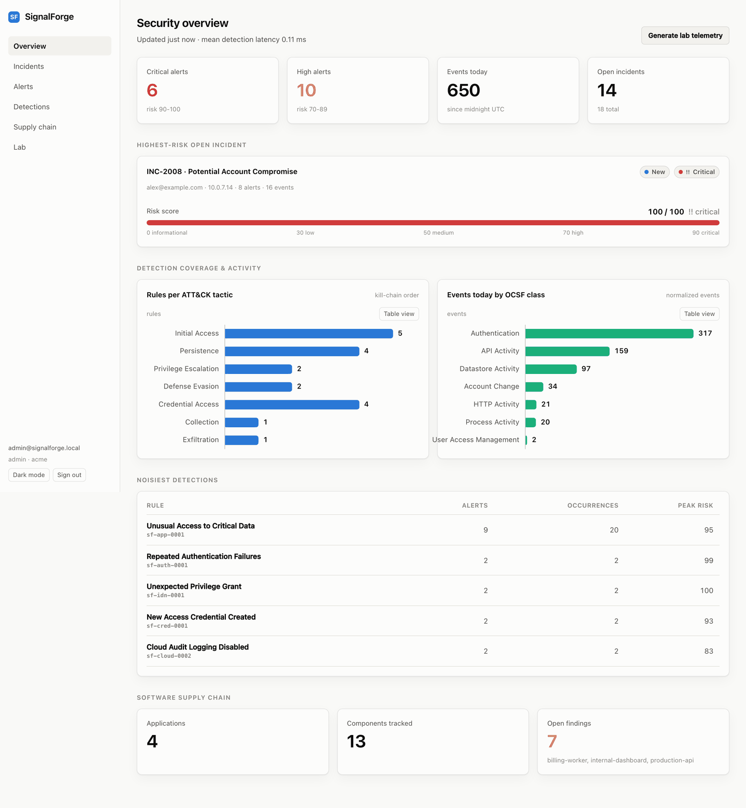

*The analyst overview: alert counts by band, the highest-risk open incident with
its score, detection coverage by ATT&CK tactic, normalized event volume by OCSF
class, and the noisiest rules. Every figure below is a real screenshot of this
codebase running against the bundled lab telemetry — see
[Reproducing these screenshots](#reproducing-these-screenshots).*

---

## Contents

- [What it actually does](#what-it-actually-does)
- [Quick start](#quick-start)
- [Detection engineering](#detection-engineering)
- [Correlation and risk scoring](#correlation-and-risk-scoring)
- [Normalization and identity resolution](#normalization-and-identity-resolution)
- [Enrichment](#enrichment)
- [Incidents, response and audit](#incidents-response-and-audit)
- [Software supply chain (SBOM)](#software-supply-chain-sbom)
- [Testing](#testing)
- [Performance](#performance)
- [Repository layout](#repository-layout)
- [Configuration](#configuration)
- [Security posture and scope](#security-posture-and-scope)
- [The dashboard](#the-dashboard)
- [Roadmap](#roadmap)

---

## What it actually does

| Capability | Implementation |
|---|---|
| **Log collection** | Vector config for host/app/cloud logs, plus a self-contained collector service (file tailing with persisted offsets, stdin, or generated lab telemetry) |
| **Streaming** | Kafka/Redpanda with manual offset commits (at-least-once), a dead-letter topic, and an in-process bus with identical semantics for tests |
| **Normalization** | Every source mapped to an OCSF 1.3-shaped event model; cross-source identity resolution so one human is one principal |
| **Detection** | A Sigma implementation: condition parser, full field-modifier semantics, streaming evaluator, and an OpenSearch Query DSL backend for retro-hunting |
| **Correlation** | Sigma v2 correlation rules - `event_count`, `value_count`, `temporal`, `temporal_ordered` - over sliding windows keyed by entity |
| **Risk scoring** | Documented experimental model: severity × confidence × asset criticality, adjusted by behavioural context |
| **ATT&CK** | Tactics and techniques from rule tags, rendered as an ordered kill chain per incident |
| **Enrichment** | Multi-provider threat intel (internal classification, checked-in static feed, optional HTTP feed) with caching, retry/backoff and a circuit breaker |
| **Case management** | Incidents with a validated state machine (including a `waiting` state with a wake-up timer), dedup, notes, evidence and a full audit trail |
| **Queues and shifts** | Team queues an incident is *automatically routed to* by rules in git, before anyone claims it; claim/release, transfer with a mandatory reason, per-transition role permissions, optimistic concurrency on every write, and a shift-handover report |
| **Notifications** | Pluggable channels (log, generic webhook, Slack) driven off incident events, persisted before delivery, retried with backoff, and never sent to the person who caused the event |
| **Collaboration** | Threaded comments with `@mention` resolution, a watch list that records why each person is on it, mention-driven watching that never implies ownership, case linking with per-direction semantics, evidence-moving merges, and live presence |
| **Service levels** | Per-severity acknowledge/resolve clocks from a policy file, derived (never stale) breach state, once-only escalation by the worker, and MTTD/MTTA/MTTR, SLA attainment, queue age and reopen rate per team and analyst |
| **Response** | Approval-gated playbooks scoped to this deployment's own lab resources, dry-run by default, four-eyes approval |
| **Supply chain** | CycloneDX/SPDX ingestion, version-range vulnerability matching, "which applications contain it" impact queries |
| **Multi-tenancy** | Every query is tenant-scoped from the caller's token; cross-tenant reads are 403 |
| **Observability** | Prometheus metrics on every service, optional OTLP tracing, Grafana dashboard, alert rules |

## Quick start

### Everything in Docker

```bash
cp .env.example .env            # then edit the secrets
docker compose up -d --build
open http://localhost:3000      # dashboard  (admin@signalforge.local / signalforge)
open http://localhost:8000/docs # API reference
```

The `collector` service starts in **lab mode**, so the pipeline has telemetry
flowing within a few seconds and the dashboard is populated. Add
`--profile observability` for Prometheus (`:9090`), Grafana (`:3001`) and
OpenSearch Dashboards (`:5601`).

### Just the Python side, no infrastructure

Every infrastructure dependency has an in-process fallback, so the whole
pipeline runs on a laptop with nothing else installed:

```bash
python -m venv .venv && source .venv/bin/activate
pip install -e "libs/signalforge[dev]" "fastapi>=0.115" "uvicorn[standard]" python-multipart

pytest                                             # the full test suite
make lint                                          # ruff + ruff format --check + mypy
python scripts/validate_rules.py detections        # the detection linter
python scripts/demo.py                             # end-to-end walkthrough in the terminal

PYTHONPATH=libs/signalforge:apps/api uvicorn app.main:app --reload   # API on :8000
```

`SIGNALFORGE_BUS_BACKEND=memory` and `SIGNALFORGE_EVENT_STORE_BACKEND=memory`
(the defaults) select the in-process bus and event store; SQLite backs the
metadata store. Point the settings at Kafka/OpenSearch/PostgreSQL and the same
code paths run distributed.

### The vertical slice, end to end

```bash
python scripts/demo.py --scenario account_compromise
```

That takes one `sshd` line at a time through ingestion → normalization → Sigma
detection → correlation → incident → timeline, and prints what happened at each
hop:

```
13:41:02  linux.sshd    Authentication / Logon / Failure   alex@example.com  10.0.4.82
...
ALERT   sf-auth-0001  Repeated Authentication Failures        risk 41  (medium)
ALERT   sf-auth-0002  Successful Interactive Logon            risk 22  (informational)
ALERT   sf-idn-0001   Unexpected Privilege Grant              risk 74  (high)
ALERT   sf-cred-0001  New Access Credential Created           risk 72  (high)
CORR    sf-corr-0003  Potential Account Compromise            4 stages
INC-2001  Potential Account Compromise    risk 88/100  critical
          Credential Access → Initial Access → Privilege Escalation → Persistence
```

## Detection engineering

Detections are **code**, not configuration in a UI. They live in `detections/`,
are written in Sigma, ship with their own tests, and are linted in CI.

```yaml
title: Repeated Authentication Failures
id: sf-auth-0001
name: auth_repeated_failures
logsource:
  category: authentication
detection:
  selection:
    class_uid: 3002        # OCSF Authentication
    activity_id: 1         # Logon
    status: Failure
  filter_machine_accounts:
    actor.user.name|endswith: '$'
  timeframe: 5m
  condition: selection and not filter_machine_accounts | count() by actor.user.name >= 5
level: medium
tags: [attack.credential_access, attack.t1110.001]
falsepositives:
  - Load-test and performance harness accounts
signalforge:                # namespaced extension, still valid Sigma
  confidence: 8
  dedup_by: [actor.user.name, src_endpoint.ip]
```

The pipeline is the one described in the Sigma docs, implemented here:

```
Sigma YAML → parser → internal representation → ┬→ streaming evaluator → alert
                                                └→ OpenSearch DSL → retro-hunt
```

Both backends walk the same AST and the same compiled matchers, so a rule cannot
mean one thing live and another thing in a hunt.

**Implemented Sigma surface**

- conditions: `and` / `or` / `not`, parentheses, `1 of x`, `all of x`, `1 of them`,
  `all of them`, wildcard identifiers (`selection_*`), list-of-conditions (OR),
  and the aggregation tail `| count() by <field> >= N` (plus `min`/`max`/`sum`/`avg`
  and `count(<field>)` for distinct counts)
- field modifiers: `contains`, `startswith`, `endswith`, `all`, `re` (+ `i`/`m`/`s`),
  `cased`, `cidr`, `lt`/`lte`/`gt`/`gte`, `exists`, `base64`, `base64offset`
  (with pySigma's slice semantics), `utf16`/`utf16le`/`utf16be`/`wide`, `windash`,
  `fieldref`
- null handling (`field: null` means absent or null), keyword searches,
  list-of-maps searches (OR of ANDs), `detection.timeframe`
- Sigma v2 `correlation` rules: `event_count`, `value_count`, `temporal`,
  `temporal_ordered`, with `group-by` and `timespan`

**Logsource pipeline.** Rules are written against OCSF field paths, and a
processing pipeline maps community Sigma field names onto them
(`TargetUserName` → `user.name`, `sourceIPAddress` → `src_endpoint.ip`,
`CommandLine` → `actor.process.cmd_line`, …), plus `logsource.category` →
OCSF `class_uid` so a rule only ever sees events it is scoped to.

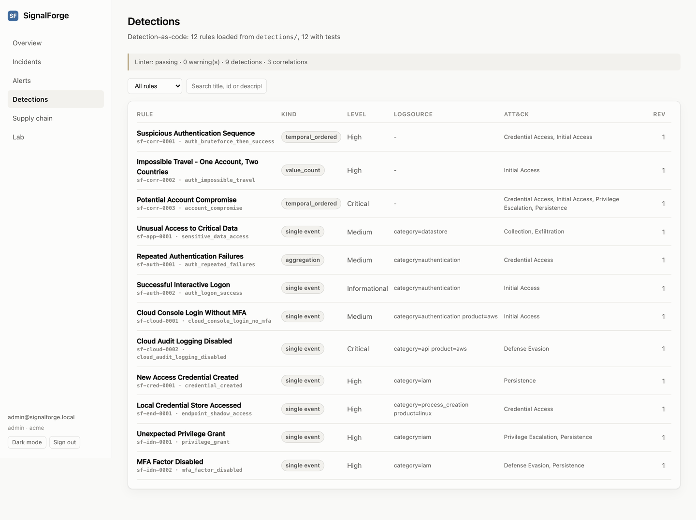

*Every rule in the repository, with its level, ATT&CK tactics, test coverage and
how often it has fired. Rules that ship without tests are visible immediately.*

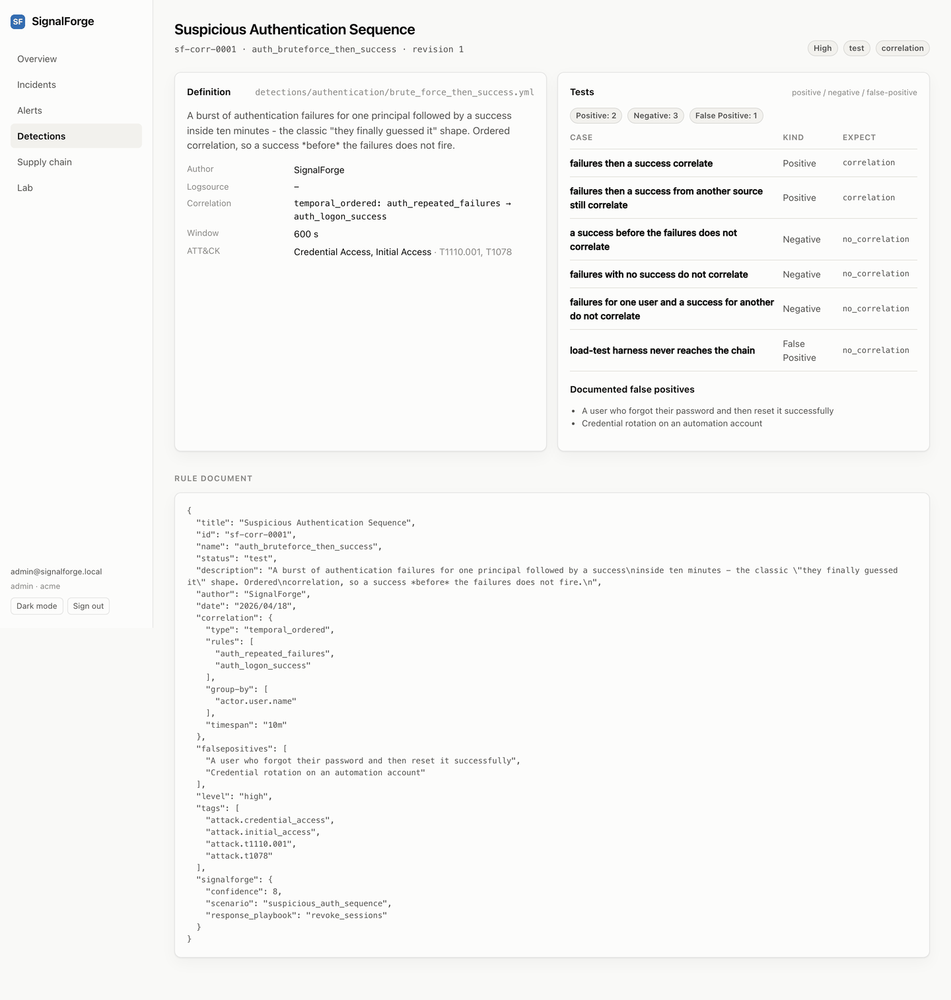

*Opening a rule shows the Sigma source as committed, its content-hash revision,
its declared tests and the alerts it has produced — detection-as-code with the
code actually on screen.*

**The linter (`scripts/validate_rules.py`)** fails a pull request for: an
unparseable rule, a condition referencing a search that does not exist, a
duplicate id or name, an aggregation without a `timeframe`, an unresolvable
correlation reference, a missing ATT&CK tactic tag, a missing test file — and
**a field name that is not part of the OCSF schema**, because a typo like
`src_endpoint.adress` is a rule that silently never fires.

## Correlation and risk scoring

Individual alerts are rarely the story. Correlation rules join them by entity
over a time window:

```yaml
title: Potential Account Compromise
id: sf-corr-0003
correlation:
  type: temporal_ordered
  rules: [auth_repeated_failures, auth_logon_success, privilege_grant, credential_created]
  group-by: [actor.user.name]
  timespan: 15m
level: critical
```

Those four stages arrive from **three different sources** (`sshd`, the
application audit log, CloudTrail) and still group together, because
normalization resolves `alex`, `alex@example.com` and `AIDAEXAMPLEALEX` to one
principal.

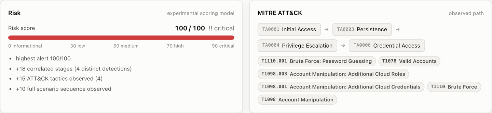

*The two halves of a correlated incident: the score with every contributing
factor named, and the observed ATT&CK path ordered by kill chain. The score is
never a bare number — "+18 correlated stages (4 distinct detections)" is the
part an analyst can argue with.*

### The risk model

> **This is SignalForge's own experimental model, not an industry standard.**
> It is documented here so the numbers on the dashboard are reproducible, not
> because it is a recognised scoring scheme.

An alert:

```
base   = 100 × (severity/10 × confidence/10 × asset_criticality/10) ^ (1/3)
share  = (modifier − 1) / (CEILING − 1)                    # CEILING = 1.60

score  = base + min((100 − base) × share, 25 × share)      if modifier ≥ 1
       = base × modifier                                   otherwise
```

The geometric mean means one weak factor (a low-confidence detection) pulls the
score down without any single factor dominating. Aggravating context consumes
the *remaining headroom* to 100 — capped at 25 points, so a weak detection in a
bad neighbourhood can never outrank a strong one; mitigating context (a
load-test account, a maintenance window) multiplies instead, because there
deflation is the point.

Worked example — the "unusual administrator login" from the design notes:

| Factor | Value |
|---|---|
| Severity (rule level `high`) | 8/10 |
| Detection confidence | 9/10 |
| Asset criticality | 9/10 |
| Context modifier | 1.0 |
| **Score** | **87 / 100 → high** |

Add an external source address and a missing second factor (×1.21) and it
becomes 91; add a known-malicious indicator and it is 96.

An incident scores from the alerts correlated into it:

```
bonuses = chain_bonus + breadth_bonus + intel_bonus + scenario_complete_bonus
score   = max_alert_score + (100 − max_alert_score) × bonuses / 100
```

which produces the escalation ladder the design called for:

| Evidence | Score |
|---|---|
| 5 failed logons | 15 |
| …then a success | 47 |
| …then a privilege grant (+ intel hit) | 78 |
| …then a new API credential (full chain) | 88 |

Bands: `0-29` informational · `30-49` low · `50-69` medium · `70-89` high ·
`90-100` critical. `GET /api/v1/stats/risk-bands` returns them, so the UI and
this README cannot disagree.

**Context signals** (each a documented multiplier): external source,
known-malicious indicator, anonymising infrastructure, no MFA, off-hours,
privileged target, critical asset touched, first-seen source, service account
(damping), load-test account and maintenance window (suppressing).

## Normalization and identity resolution

Different sources describe the same thing differently:

```json
// AWS CloudTrail                    // Linux sshd
{ "eventName": "ConsoleLogin",       Sep 10 13:42:10 web-01 sshd[2312]:
  "sourceIPAddress": "10.1.4.25" }   Accepted password for john from 10.1.4.25 port 55240
```

Both become one shape:

```json
{
  "class_uid": 3002, "class_name": "Authentication",
  "activity_id": 1, "activity_name": "Logon",
  "status": "Success", "severity": "Informational",
  "actor": { "user": { "name": "john", "email_addr": "john@example.com" } },
  "src_endpoint": { "ip": "10.1.4.25" },
  "device": { "hostname": "web-01" },
  "time": "2026-09-10T13:42:10Z",
  "observables": [ { "type": "ip", "value": "10.1.4.25" } ]
}
```

Implemented sources: **Linux** (`sshd`, `sudo`, shadow-utils, auditd),
**AWS CloudTrail**, **Okta System Log**, and the **lab application audit log** —
covering OCSF Authentication, Account Change, Authorize Session, User Access
Management, Group Management, Entity Management, Process Activity, File System
Activity, API Activity, HTTP Activity and Datastore Activity.

Two details that matter more than the mapping itself:

- **Content-hash dedup.** Every event carries a `sf_dedup_key` computed from its
  semantic content (excluding ingest metadata). That hash is the OpenSearch
  document `_id`, so at-least-once redelivery is an idempotent overwrite, and the
  detection engine skips events it has already evaluated — a replayed batch
  cannot inflate a brute-force count.
- **Identity resolution.** `schemas/identities.yml` maps each canonical email to
  the aliases sources emit, so cross-source correlation actually holds together.

## Enrichment

When SignalForge sees an indicator it attaches internal/external classification,
ASN, country, reputation verdict, categories and first/last-seen, then feeds the
verdict back into the risk context. Providers are tried in order and merged:
internal network classification, a **checked-in static feed**
(`schemas/intel/static_feed.json` — documentation ranges and public Tor exit
ranges, so nothing depends on scraping a third party), and an optional HTTP feed
you are authorised to query.

Every lookup is cached (Redis, or in-process), each provider has retry with
exponential backoff and jitter, and a repeatedly failing provider trips a
circuit breaker and returns a `degraded` verdict — enrichment is additive
context and never blocks detection.

## Incidents, response and audit

```
NEW → TRIAGED → INVESTIGATING → CONTAINED → RESOLVED
         │            │  ↑                        
         └────────────┴──┴──→ WAITING  └─────────→ CLOSED_FALSE_POSITIVE
```

Transitions are validated (an illegal one is a `409`, not a silent write) and
every transition, assignment, note and response action writes an audit row.

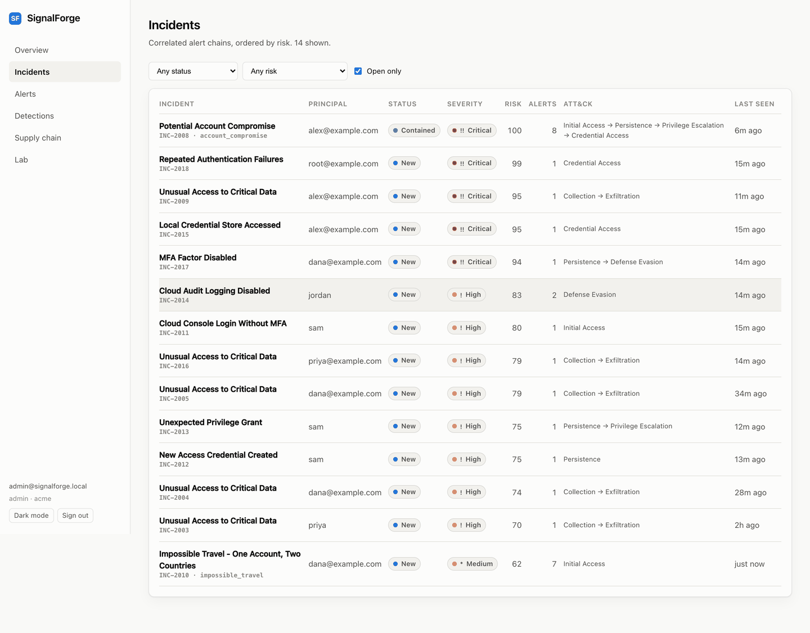

*The incident queue, risk-ranked. Filters for status, severity and score, with
the correlated scenario and ATT&CK tactics on every row.*

`WAITING` is for work parked on something outside the SOC's control — a reply
from the account owner, a vendor ticket. It requires both a reason and a
wake-up time, because without it analysts park cases by leaving them in
`INVESTIGATING` and the queue stops describing what is actually being worked.

**Who may do what.** Legal-for-the-state-machine and permitted-for-this-person
are separate questions. Containment touches real resources, so it needs the
`responder` role. Closing a real detection as a false positive is the expensive
mistake, so it needs `admin` — or a **lead of the owning team**, the same
second-pair-of-eyes principle the response playbooks use.

### Queues and teams

An incident belongs to a *team* before it belongs to a person, so work nobody
has picked up is still visibly somebody's:

```
  detection ──route──▶ team queue ──claim──▶ analyst ──transfer──▶ other team
                            ▲                    │                     │
                            └──── unclaim ───────┘            reason required
```

- **Claiming** stamps `acknowledged_at` (the clock MTTA is measured from).
  Claiming an incident someone else holds is a `409`, not a silent takeover —
  two analysts unknowingly working one case is exactly what this prevents. A
  lead can `force` a reassignment when a shift ends.
- **Transferring** demands a reason. "Moved to Cloud Security because the
  credential was an IAM key, not an app token" is the sentence the receiving
  team needs and the one nobody writes voluntarily.
- **Concurrent edits** are caught by a `version` on every incident: send back
  the version you read, and a write from a stale view is rejected with the
  current state rather than overwriting someone's work.
- `GET /teams/{slug}/queue` is oldest-first — the opposite of the risk-ranked
  incident list, because a queue is worked from the bottom and the oldest
  unclaimed item is the one most likely to breach. `GET /teams/{slug}/handover`
  is the shift-handover projection: every open case with its last action.

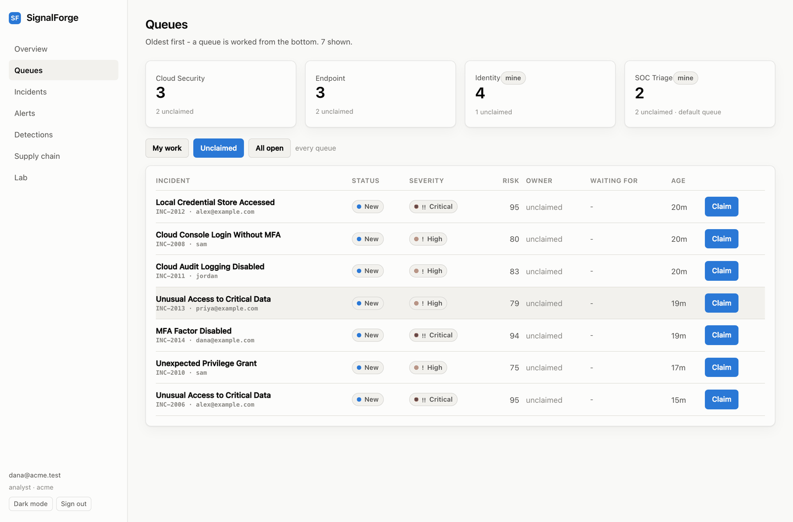

*The queue view, and deliberately not the incident list. That page is
risk-ranked, answering "what is worst?". A queue answers "what do I pick up
next?", so it is oldest-first with queue depth per team, a scope switcher
(**My work · Unclaimed · All open**) and a claim button on every unheld row.*

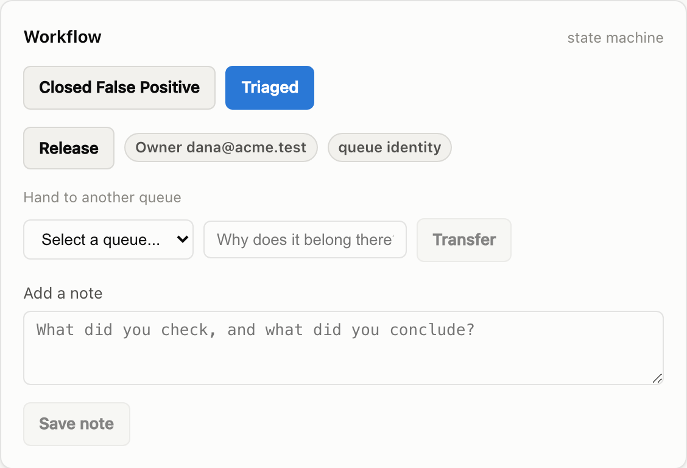

*The same operations on one incident: claim or release, park it with a reason
and a wake-up time, or hand it to another queue — where the reason field is
mandatory and the current queue is excluded from the picker.*

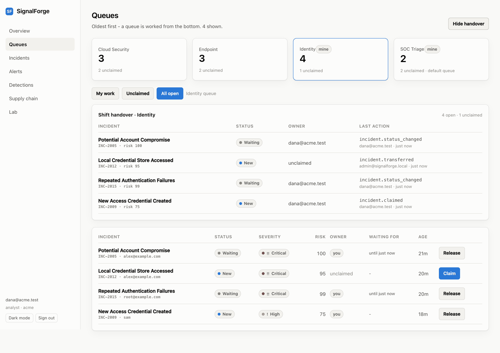

*The handover projection: every open case in the queue with its owner and its
most recent action, which is the artefact one shift actually gives the next.*

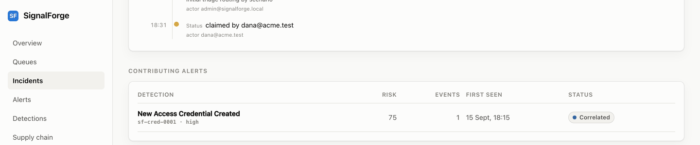

*Two analysts, one incident. Sam's page was open while Dana claimed it, so
Sam's write carries a stale version and is refused rather than silently
overwriting her — the page reloads and says why.*

### Routing rules

An incident does not wait for a human to file it. Routing lives in git next to
the detections, for the same reasons:

```yaml
# routing/identity.yml
title: Identity owns identity and credential detections
id: route-identity-0001
priority: 10
team: identity
match:
  rule_id: [sf-idn-*, sf-cred-*]
```

Rules are evaluated in `priority` order and **the first match wins**, so
overlap is resolved by an explicit number rather than by file order. A rule with
no `match` block matches everything, which is how the catch-all is written.
Conditions inside one `match` block are ANDed; values inside one condition are
ORed. Eleven fields are matchable (`rule_id`, `scenario`, `tactic`,
`technique`, `severity`, `min_risk`/`max_risk`, `principal`, `hostname`,
`source_ip`, `tenant`), and the globbable ones take patterns.

**Match on `rule_id` before `scenario`.** `scenario` is only set on incidents a
*correlation* rule opened; a severe single alert opens its own incident with no
scenario at all. A table built only on scenarios sends most real traffic to the
catch-all. Detection ids carry the domain (`sf-idn-*` identity, `sf-cloud-*`
cloud, `sf-end-*` endpoint), which makes them the reliable signal — see
[routing/README.md](routing/README.md).

Routing is **audited like everything else**: the incident records which rule
placed it, so "why is this in my queue?" is answerable. And it runs **only at
creation**, so an analyst's transfer is not undone the next time an alert joins
the incident.

Two things stop a routing table rotting:

```bash
python scripts/validate_rules.py detections    # lints routing/ under the same gate
```

The linter rejects an unknown match field (a typo is a rule that silently never
fires), a duplicate rule id, a missing catch-all, a second catch-all, and any
rule sitting *behind* the catch-all where it can never match. And the preview
endpoint answers both questions a routing change raises — where this goes now,
and what else just changed:

```bash
curl -X POST localhost:8000/api/v1/routing/preview \
  -d '{"rule_ids": ["sf-idn-0002"], "tactics": ["defense_evasion"]}'
# -> team "identity" via route-identity-0001, plus every rule with its verdict
```

That example is a real one. MFA removal is tagged `defense_evasion`, so a
tactic-only table hands it to whoever owns that tactic — cloud security. The
detection id is unambiguous, and the preview is how that was diagnosed.

### Linking and merging cases

One intrusion should be one case. Three relationships, each with its own
directionality because conflating them loses what makes a link useful:

| Relationship | Reads from the other end as |
|---|---|
| `related_to` | `related_to` — symmetric, so it is stored once |
| `duplicate_of` | `duplicated_by` |
| `caused_by` | `led_to` |

A directional link gets an inverse *label* rather than the same word pointing
backwards, and a symmetric one is a single row presented from both sides — so
linking A to B and then B to A does not show the incident related to its
partner twice.

**A merge moves evidence, it does not copy it.** The duplicate's alerts are
repointed at the survivor, so afterwards every alert belongs to exactly one
incident and no count can double. The survivor inherits the union of events,
entities, addresses, hosts, tactics and techniques, the wider time span, and
the worse of the two risk scores. The duplicate closes with a `duplicate_of`
link recording where it went, which is what makes the merge explainable later.

Merging an already-closed incident is refused: closing it was a decision
somebody made, and a merge must not bury it.

**There is no UI for this yet.** Until there is, `scripts/case.py` is the
supported way to drive it — and it adds the merge preview the API does not have,
because a merge is not practically reversible:

```bash
python scripts/case.py link INC-2004 INC-2007 --rel related_to --reason "same credential"
python scripts/case.py merge INC-2005 INC-2006              # preview
python scripts/case.py merge INC-2005 INC-2006 --confirm    # apply
```

Recipes and the two deliberate refusals are in
[docs/RUNBOOK.md](docs/RUNBOOK.md#linking-merging-and-presence-no-ui-yet).

### Who else is looking at this

Optimistic concurrency stops a stale write, but only *after* the analyst has
typed. Presence is the cheap preventative half — `POST
/incidents/{ref}/presence` is a heartbeat that returns who *else* is viewing.

Deliberately not in the database: presence is worthless thirty seconds later,
so it lives in Redis when configured and in-process otherwise, with a 30-second
TTL. A row per heartbeat would turn a cosmetic feature into write load on the
incident table. If Redis is unreachable it falls back to in-process rather than
failing — presence must never stop the API serving incidents.

Nothing in the dashboard calls it yet, so the indicator this was built for does
not appear. `python scripts/case.py viewers INC-2004` is the workaround, and it
reports which backend is in use — `memory` in a multi-replica deployment means
each replica sees only its own viewers.

### Discussion and watchers

Notes became **threaded comments** rather than gaining a parallel "comments"
concept beside them — one place where analysts write things about an incident is
easier to reason about than two that overlap.

```
dana@acme.test   Source 185.220.101.7 is a known Tor exit. @sam can you confirm?
  └ sam@acme.test  Confirmed - not in the change calendar. cc @rio
```

`@dana` resolves on the local part when it is unambiguous inside the tenant;
`@dana@acme.test` always resolves. A local part shared by two people is reported
**ambiguous rather than guessed at**, and a handle matching nobody comes back in
the response instead of being dropped — silently discarding it leaves the author
believing somebody was notified.

A bare address in prose is not a mention. Without a word-boundary check,
"the account dana@acme.test was disabled" parses `@acme.test` as a handle and
warns the author about a mention they never wrote.

**Watching is not owning.** Being mentioned puts you on the notification list
without making the incident yours — a lead watching six cases is not working six
cases. The watch list records *why* each person is on it (`mentioned`,
`assigned`, `manual`), and a deliberate watch is never downgraded by a later
mention.

Mentions are highlighted from the **stored** resolved list rather than
re-parsed in the browser: the server already decided who a handle meant, and
re-deciding client-side would drift the moment somebody is renamed. Rendering is
segment-based, never `innerHTML`, so a comment body cannot inject markup.

### Notifications

A mention that adds a watcher but tells nobody is half a feature, so mentions,
transfers and SLA breaches dispatch through pluggable channels — `log` (the
default), a generic JSON `webhook`, or `slack`.

**Nobody is notified about their own action.** A channel that tells you what you
just did is a channel that gets muted, and a muted channel is worse than none.
Recipients are the watch list, the assignee, and — for a breach or a transfer —
the owning team's leads, minus the actor.

**Every notification is persisted before any channel is called.** That is what
makes `GET /stats/notifications` answerable: "nobody was told" and "nobody
*should* have been told" are different situations, and a log line cannot tell
them apart. With no channel configured, notifications are marked `suppressed`
rather than left `pending` forever for a retry that can never succeed.

Retry backoff is 0 / 1 / 5 / 30 minutes and then gives up. A webhook that has
refused four times across half an hour is not coming back inside this window,
and an unbounded retry queue is one nobody drains. The policy lives in the
dispatcher and nowhere else — channels report success or failure and never back
off themselves, or two layers compound and the effective interval is anybody's
guess.

A failing channel never fails the operation. The claim, transfer or comment
happened; the notification row records that the telling did not.

### Service levels and SOC metrics

Every incident runs two clocks from the moment it opens: **acknowledge** (until
a person claims it) and **resolve** (until it reaches a terminal state). The
targets are per-severity policy in [schemas/sla.yml](schemas/sla.yml) — in git,
because they are the numbers a SOC is judged on:

| Severity | Acknowledge | Resolve |
|---|---|---|
| critical | 15 min | 4 h |
| high | 1 h | 8 h |
| medium | 4 h | 24 h |
| low | 24 h | 7 d |
| informational | — | — |

Informational has no targets deliberately: putting a clock on work nobody
intends to do only manufactures breaches.

**Breach is derived, never stored as a flag.** A stored boolean is wrong the
moment a deadline passes and nothing has run to update it; computing it from the
due time against `acknowledged_at`/`closed_at` means the answer is right
whenever it is asked. A *finished* clock is judged on when it finished, so an
incident acknowledged inside its window stays "met" forever rather than turning
into a breach once the window elapses.

The worker sweeps breaches every two minutes and escalates once — bumping
severity, writing the timeline entry and the audit row. `sla_escalated_at` is
what makes it idempotent: a tight schedule re-pages nobody.

`GET /stats/soc` is the report:

```
window: 7 days | opened 12 | closed 4
MTTD 8.8m     MTTA 15s      MTTR(resolved) 4s
SLA ack: 2 met of 12 (0.167) | resolve: 12 met of 12
queues:
  endpoint         open=3   unclaimed=2   oldest=1.1m
  identity         open=3   unclaimed=3   oldest=1.1m
by analyst:
  dana@acme.test   claimed=2   mtta=15s
```

Three definitions worth stating, because every SIEM means something slightly
different:

- **MTTA** is measured from the *first* claim, so passing a case around later
  does not flatter it.
- **MTTR** is split by disposition. A false positive closed in two minutes and
  a real intrusion contained in six hours are not the same achievement and
  should not average together.
- **Reopen rate** divides by *analyst closures* from the audit trail, not by
  what is closed right now. An incident that was closed and then reopened still
  happened, and an incident the correlator superseded into a chain was never a
  human deciding it was finished.

**Queue age** — the oldest unclaimed incident per queue — is the one to watch.
It goes bad before MTTA does.

### Database migrations

The metadata schema is versioned with Alembic. `alembic upgrade head` runs when
a service opens the database (`SIGNALFORGE_DB_AUTO_MIGRATE`, on by default);
turn it off where migrations are applied as a separate ordered step.

```bash
make migrate                        # alembic upgrade head
make migration m="add sla columns"  # autogenerate a revision from model changes
make migration-status               # current revision + un-migrated model drift
```

The test suite builds each throwaway database straight from the models because
it is faster, which would let the two drift apart silently — so
`tests/integration/test_migrations.py` asserts that the migration chain produces
exactly the model schema, preserves existing rows across an upgrade, and rolls
back cleanly.

Incidents deduplicate: the same correlation for the same entity inside the dedup
window extends the existing incident instead of opening a second one, and a
closed incident that recurs opens a fresh one rather than reanimating the old.

**A completed chain supersedes its parts.** A severe stage alert opens its own
incident immediately — you should not have to wait for a chain to complete
before anything is actionable — but when the correlation does complete, the
stage incidents whose evidence now belongs to the chain are closed with
`Superseded by INC-…` and an audit entry. One intrusion is one case: the
bundled account-compromise scenario produces five alerts and leaves **two** open
incidents, not five.

**Investigation timeline.** Given an incident, the platform pivots on its
entities — same user, same address, same host, same session — and reconstructs
what happened around it, ordered by *event* time so late-arriving logs land in
the right slot:

```
13:39:58  Event     Authentication: Logon      Failure   alex@example.com  10.0.4.82
13:41:02  Alert     Repeated Authentication Failures     risk 41, 6 events
13:42:10  Event     Authentication: Logon      Success   alex@example.com
13:43:05  Event     User Access Management: Assign Privileges   → admin
13:44:40  Event     Account Change: Create     token tok_9f2c
13:46:11  Event     Datastore Activity: Read   customer-records (48,000 records)
13:47:02  Response  Response requested: Contain lab account   awaiting approval
```

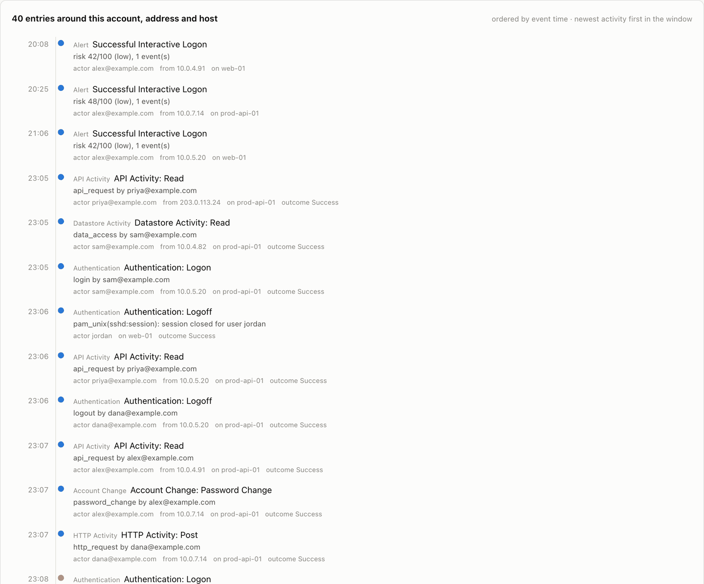

*The reconstructed timeline. Alerts and raw events interleaved on one axis,
ordered by **event** time so a log that arrived late still lands in the right
slot, with the actor, source address and host on every row.*

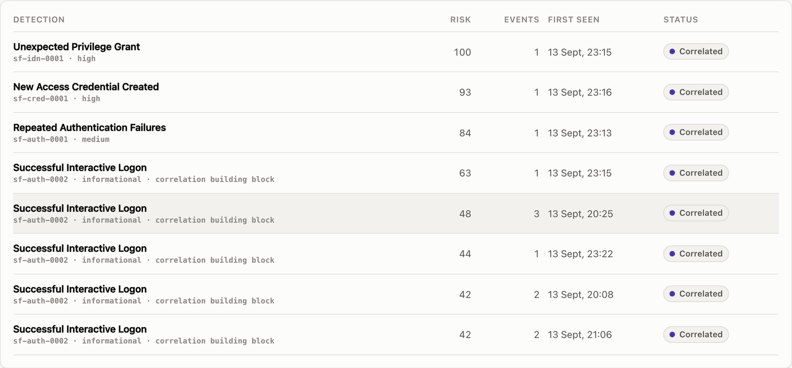

*The alerts the incident is built from. Correlation building blocks are labelled
as such: they are informational on their own and only meaningful as part of the
chain, which is why they never page anyone individually.*

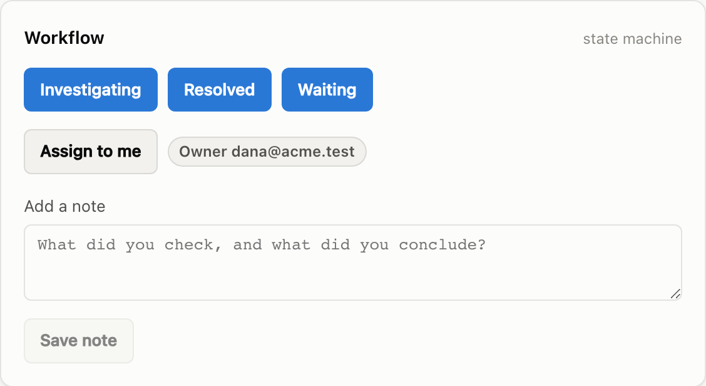

*The state machine as the analyst sees it — only legal transitions are offered,
and the API rejects anything else with a `409` rather than writing it.*

**Response playbooks** are deliberately conservative:

- nothing runs without an analyst — a playbook is *requested*, then approved by
  someone with the responder role who is **not** the requester;
- **dry-run by default** (`SIGNALFORGE_RESPONSE_DRY_RUN=true`) — it reports what
  it would do and changes nothing;
- targets are resources this deployment owns: its own denylist file, the lab
  application's own accounts/sessions/tokens, a disposable lab container;
- request, approval and execution are all audited.

Shipped playbooks: disable lab account, revoke lab sessions, revoke lab API
token, remove elevated role, add IP to the local denylist, isolate a disposable
lab container, a composite "contain account", and notify-only.

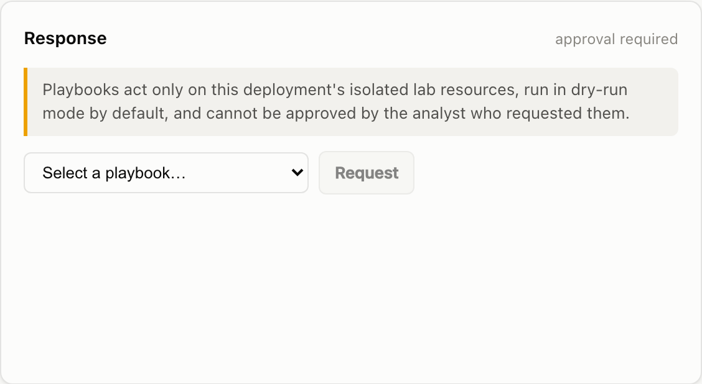

*Requesting a playbook. The warning is not decoration: the adapter refuses
targets outside this deployment's own lab resources.*

**Everything lands in the audit trail**, which is the record of who did what:

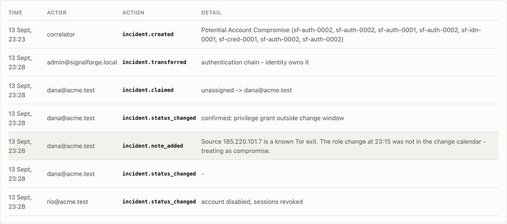

*One incident's full history: the correlator opened it, an admin routed it to
the Identity queue **with a reason**, Dana claimed and triaged it, left a note,
and a responder contained it. Two attempts are missing from this list because
they were refused — Sam's attempt to claim an incident Dana already held
(`409`), and Dana's attempt to contain it without the responder role (`403`).*

## Software supply chain (SBOM)

Upload a **CycloneDX** or **SPDX** document (format auto-detected) and
SignalForge tracks the component inventory per application. Record an advisory
and it answers the question that matters:

```
CVE-2026-31337 · library-x >=2.4.0 <2.4.2 · fixed in 2.4.2

Production API        affected      2.4.1 (direct)
Internal dashboard    affected      2.4.1 (transitive)
Mobile backend        unaffected    2.4.2
Batch pipeline        not present   —
```

Version comparison handles semver, PEP 440's common shapes and pre-release
ordering (`2.4.0-rc1 < 2.4.0`); a component already at or past the fixed version
is reported unaffected rather than flagged.

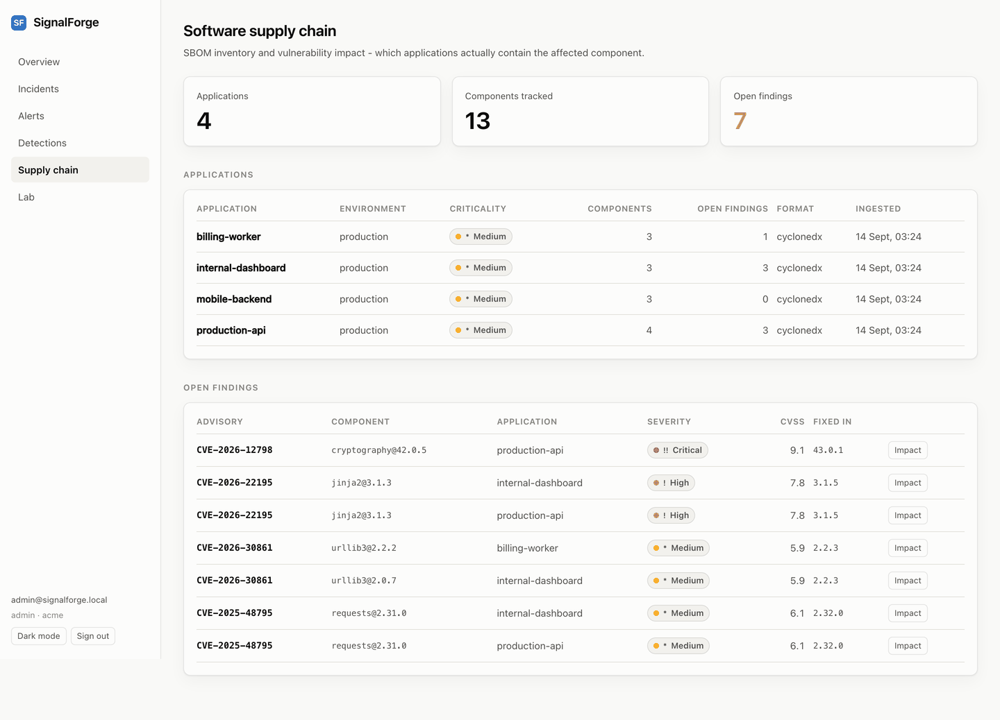

*Ingested SBOMs, the advisories matched against them, and the blast radius of
each one. `mobile-backend` appears as unaffected rather than absent, because it
carries the package at a version past the fix — the distinction that decides
whether anyone has to do anything.*

## Testing

```bash
pytest                       # everything
pytest tests/detections      # every rule's positive/negative/false-positive cases
pytest tests/integration     # pipeline, dedup, ordering, failure handling, tenancy
pytest tests/e2e             # through the FastAPI app
SIGNALFORGE_RUN_LOAD=1 pytest tests/load    # throughput and latency
```

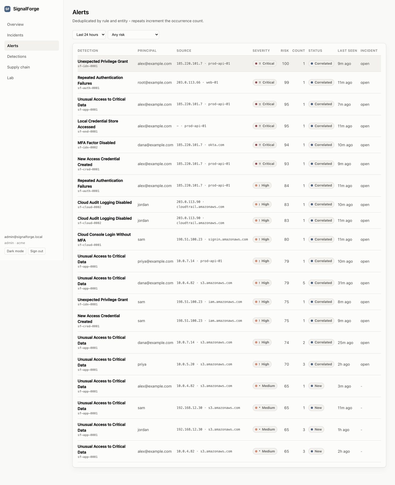

*The alert stream behind the incidents, filterable by risk band, rule and time
window — where tuning starts when a rule turns noisy.*

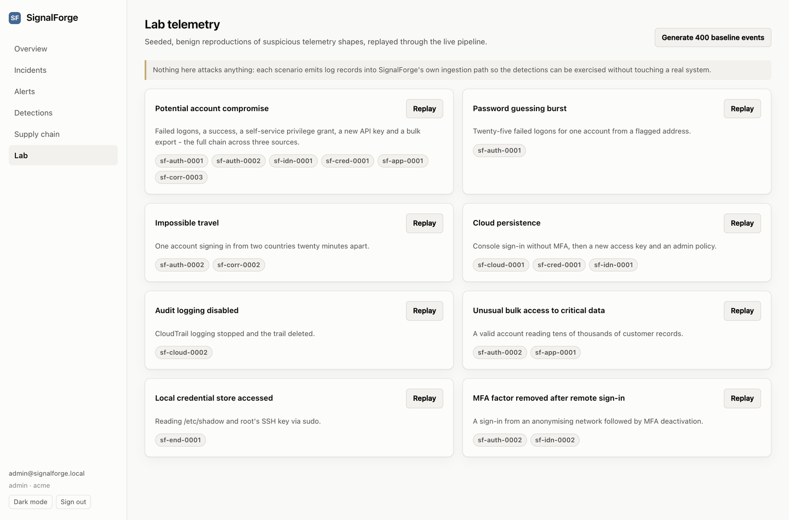

*The lab generator. Each scenario emits **benign telemetry** describing a
suspicious sequence — logs only, never traffic against a target — which is what
makes the detections testable without anything to attack.*

**Every detection ships three kinds of test** — and the linter fails the build
if one is missing:

```yaml
- name: ten failures in thirty seconds fires
  kind: positive
  expect: alert
- name: two failures in an hour does not fire
  kind: negative
  expect: no_alert
- name: authorized load-test account is suppressed
  kind: false_positive
  expect: no_alert
```

The false-positive cases exercise real mechanisms — a rule filter, a service
account type, or context-based suppression — not a special case in the test
harness.

**The distributed-systems tests are the other half of the suite:**

| Scenario | Expected behaviour |
|---|---|
| Duplicate logs received | Deduplicated (content hash, both at the store and the engine) |
| Events arrive out of order | Timeline still correct (ordered by event time) |
| Consumer crashes mid-batch | Uncommitted offsets replay; no event lost, no alert duplicated |
| Rule is malformed | Rejected by the loader and the CI linter |
| User reads another tenant | `403` |
| 10,000 events arrive quickly | No event loss |
| Detection fires twice | Alert deduplicated, incident deduplicated |
| Enrichment provider fails | Retry with backoff, then circuit breaker and a `degraded` verdict |
| Event store unavailable | Writes retried, then spooled to disk and flushed later — nothing dropped |

## Performance

The load harness (`tests/load/`) generates synthetic telemetry at a target rate
and measures ingestion throughput, detection latency, queue depth and event
loss:

```bash
SIGNALFORGE_RUN_LOAD=1 pytest tests/load -s
python scripts/benchmark.py --events 20000 --report benchmarks/latest.json
```

Measured on an **Apple M4 Pro (14 cores, 24 GB), Python 3.9.6, in-process bus
and event store, SQLite metadata**, 20,000 generated events through the full
chain (normalize → store → 12 rules → correlate → incidents):

| Metric | Result |
|---|---|
| End-to-end pipeline throughput | **3,603 events/sec** |
| Normalization throughput | **9,965 events/sec** |
| Detection latency p50 / p95 / p99 | **0.25 / 0.42 / 0.53 ms** |
| Events accounted for | **20,000 / 20,000 — zero loss** (19,983 stored + 17 content-hash duplicates) |
| Rules evaluated | 24,506 (the `class_uid` index keeps it near 1.2 per event, not 12) |
| Alerts / incidents produced | 2,577 alerts (4,607 deduplicated) → 25 incidents |

Reproduce with the command above; the raw report is
[`benchmarks/latest.json`](benchmarks/latest.json).

**What this number is and is not.** It is a single-process measurement of the
*engine*: no broker hop, no network round trip to OpenSearch, no Postgres. It
says the detection path is not the bottleneck — 0.42 ms p95 across a dozen rules
means a single detector shard has headroom. It does **not** claim a distributed
throughput figure; that needs the compose stack with Redpanda and OpenSearch
under load, which is the next benchmark (roadmap item 1).

## Repository layout

```
signalforge/
├── apps/
│   ├── api/                    FastAPI application (routers, dependencies, state)
│   └── dashboard/              Next.js + TypeScript analyst console
├── services/
│   ├── collector/              file/stdin/lab log collection → bus
│   ├── normalizer/             raw records → OCSF → event store → bus
│   ├── detector/               events → Sigma evaluation → alerts
│   ├── correlator/             alerts → correlation → incidents
│   ├── enricher/               alerts → threat intel (separate consumer group)
│   └── worker/                 Celery: spool flush, SBOM rematch, retro-hunts
├── libs/signalforge/           the engine (importable, unit-tested)
│   └── signalforge/
│       ├── models/             OCSF event, alert, incident
│       ├── normalize/          mapper registry + per-source mappers
│       ├── sigma/              parser, matchers, evaluator, OpenSearch backend, linter
│       ├── detect/             detection engine + sliding-window state
│       ├── correlate/          correlation engine + risk model
│       ├── incidents/          case management, timeline, audit
│       ├── enrich/             threat intel + cache
│       ├── response/           playbooks + approval workflow
│       ├── sbom/               CycloneDX/SPDX parsing + vulnerability matching
│       ├── auth/               JWT, tenancy, RBAC
│       └── lab/                telemetry generator
├── detections/                 detection-as-code (rules + tests, by domain)
├── schemas/                    OCSF notes, asset inventory, identities, intel feed
├── infrastructure/             Dockerfiles, Vector, Prometheus, Grafana, Terraform
├── tests/                      unit · integration · detections · e2e · load
└── docs/                       architecture, detection guide, roadmap, runbook
```

## Configuration

Everything is environment-driven with a `SIGNALFORGE_` prefix; see
[`.env.example`](.env.example) for the annotated list. The ones that change the
shape of the deployment:

| Variable | Default | Effect |
|---|---|---|
| `SIGNALFORGE_BUS_BACKEND` | `memory` | `kafka` to use Kafka/Redpanda |
| `SIGNALFORGE_EVENT_STORE_BACKEND` | `memory` | `opensearch` to use a cluster |
| `SIGNALFORGE_DATABASE_URL` | SQLite file | PostgreSQL DSN in production |
| `SIGNALFORGE_REDIS_URL` | unset | enables the shared enrichment cache |
| `SIGNALFORGE_DETECTIONS_PATH` | `detections` | rule directory |
| `SIGNALFORGE_RESPONSE_DRY_RUN` | `true` | `false` lets playbooks act on lab resources |
| `SIGNALFORGE_RESPONSE_REQUIRE_APPROVAL` | `true` | tests only; disabling is logged loudly |
| `SIGNALFORGE_JWT_SECRET` | dev value | **must** be set for any real deployment |
| `SIGNALFORGE_INTEL_HTTP_ENABLED` | `false` | enables the optional HTTP intel provider |

## Security posture and scope

- **Defensive only.** SignalForge detects, investigates and contains. There is
  no offensive tooling here: the "attack" scenarios are *log generators* that
  reproduce the telemetry shape of suspicious behaviour so the detections can be
  exercised. Nothing in this repository attacks a system.
- **Response is scoped to what this deployment owns** — its own denylist file,
  the bundled lab application's own accounts and tokens, disposable lab
  containers — and is dry-run by default behind human approval. Use it only on
  systems you own or are explicitly authorised to test.
- **Tenant isolation** is enforced on every read from the caller's token;
  cross-tenant access is a `403`, and it is covered by a test.
- **Secrets** come from the environment. The bootstrap administrator password is
  a documented default that logs a warning until it is changed.
- **Auth**: JWT access/refresh tokens, PBKDF2-SHA256 password hashing with a
  stored iteration count and transparent rehash on login, and a four-role
  hierarchy (`viewer` < `analyst` < `responder` < `admin`).
- **Its own dependencies are clean.** `npm audit` reports zero findings for the
  dashboard (Next pinned to a patched release, `postcss` overridden to the fixed
  line), and CI fails the build on any high-severity advisory — a project about
  vulnerability management should not ship with known-vulnerable dependencies.
- **Known gaps** (see the roadmap): the dashboard keeps its token in
  `sessionStorage` rather than an httpOnly cookie, detection window state is
  per-replica rather than shared, and there is no rate limiting on the API.

## The dashboard

Next.js (App Router) + TypeScript, no component framework — the styling is a
single stylesheet driven by CSS custom properties, which is why light and dark
are one token swap rather than two implementations. Ten routes: overview,
queues, incidents, incident detail, alerts, detections, detection detail,
supply chain, lab and sign-in.

<table>
<tr>
<td width="50%">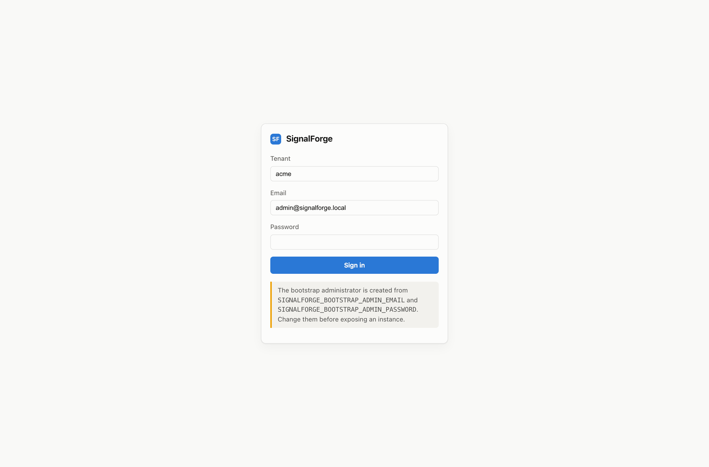</td>
<td width="50%">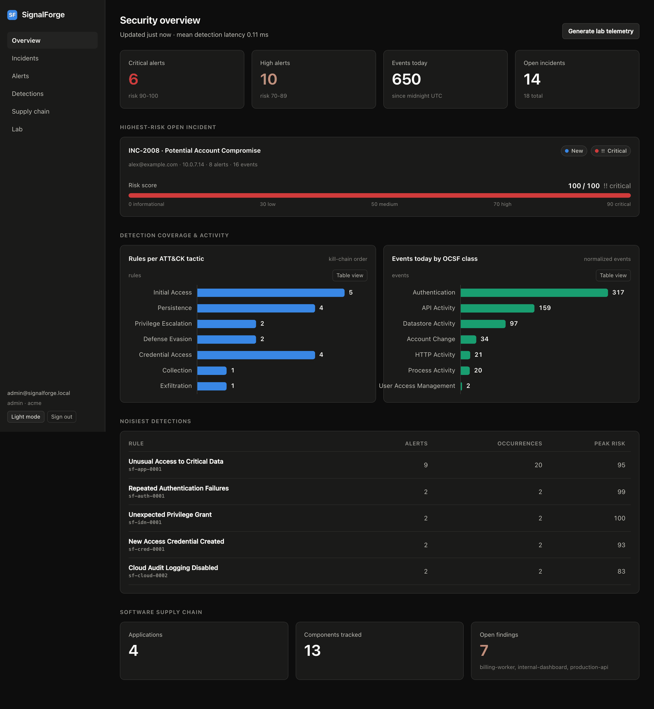</td>
</tr>
<tr>
<td><em>Tenant-scoped sign-in. The token carries the tenant, and every query is
scoped from it server-side.</em></td>
<td><em>The same overview in dark mode.</em></td>
</tr>
</table>

### Reproducing these screenshots

Every image in this README is this codebase running against the bundled lab
generator — no mockups, no hand-edited data:

```bash
docker compose up -d --build                 # or run the API and dashboard directly
make seed                                    # baseline traffic + the attack scenarios
open http://localhost:3000                   # admin@signalforge.local / signalforge
```

The incident shown is `Potential Account Compromise`, produced by the
`account_compromise` scenario: four detections firing across three sources,
correlated into one case by `sf-corr-0003`.

**What is not pictured:** the SLA countdown column on the queue, the SOC
performance panel on the overview, and the comment thread — all of which
arrived after these captures were taken. Case linking, merging and presence
have no dashboard surface at all yet: they are API-only, driven through
`scripts/case.py`, and the roadmap says so.

## Roadmap

The build order, what is done, and what is next: **[docs/ROADMAP.md](docs/ROADMAP.md)**.

**Multi-analyst operations** (Phase 7) is largely delivered: team queues,
claim/transfer with a mandatory reason, the `waiting` state, per-transition
permissions, concurrent-edit protection, the shift-handover view and the analyst
UI for all of it. What remains there is routing rules and the SOC metrics
reporting (MTTA/MTTR per team — the timestamps are recorded, the report is not
written).

Beyond that the roadmap carries a **worked future scope** across nine themes —
detection health monitoring, ingest cost attribution, entity-graph attack paths,
continuous detection validation, auditor evidence export, and a deliberately
guarded take on AI-assisted analysis (the model drafts and cites; it never
changes state, and the evaluation harness comes first). Each item names what
already exists to build it on.

Further reading:

- [docs/ARCHITECTURE.md](docs/ARCHITECTURE.md) — component boundaries, data flow, failure behaviour
- [docs/DETECTIONS.md](docs/DETECTIONS.md) — how to write, test and ship a detection
- [docs/RUNBOOK.md](docs/RUNBOOK.md) — operating the platform, common failures

## Licence

Apache-2.0. OCSF, Sigma and MITRE ATT&CK are the work of their respective
projects; SignalForge only consumes their schemas and formats.

[OCSF]: https://schema.ocsf.io/
[Sigma]: https://sigmahq.io/
